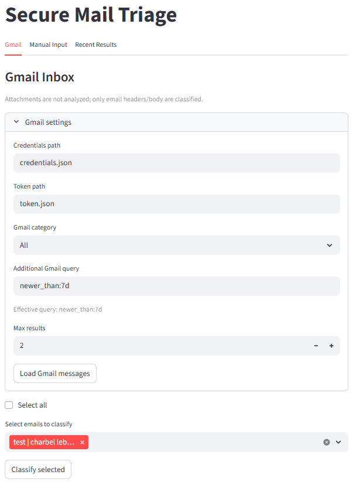
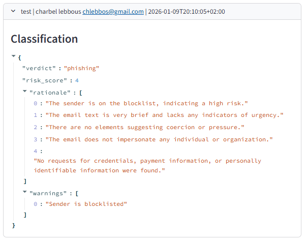
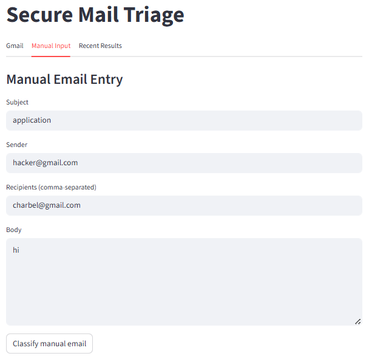
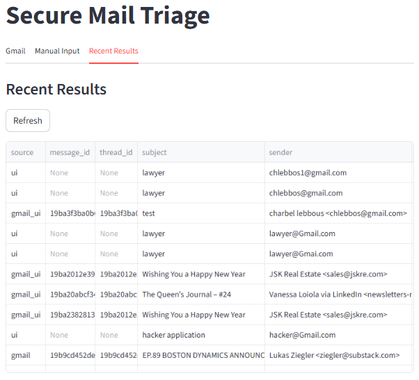

# Secure Mail Triage LLM

LLM agentic workflow for classifying and triaging phishing emails with Gmail ingestion, a UI-first experience, and SQLite audit storage. The pipeline keeps decisions explainable and easy to extend while relying on OpenAI-powered agents.

## Problem description

Phishing emails remain a top initial access vector. Manual review is slow and inconsistent, which delays response and increases risk. This project implements an LLM agentic workflow that classifies incoming messages as phishing or legitimate using specialized LLM agents and a final aggregation step, with Gmail ingestion and persistent audit logs.

## Agentic classification workflow

The pipeline decomposes classification into small, specialized LLM agents plus a final aggregator, with a rule-based link safety check (attachments are not analyzed).

1. **Email Structure Extractor (deterministic)** -> normalizes headers/body, extracts URLs/domains, and outputs structured fields.
2. **Tone & Intent LLM Agent** -> scores urgency, coercion, and impersonation cues in the normalized body text.
3. **Content Policy LLM Agent** -> flags credential harvest attempts, payment/transfer asks, and PII collection with detected term spans.
4. **Link Safety Agent (rules)** -> evaluates domains using heuristics (no attachment analysis).
5. **User/Org Context LLM Agent** -> applies allow/block lists and simple anomalies (duplicate recipients) to adjust risk.
6. **LLM Aggregator** -> fuses all agent outputs into a risk score and verdict with rationale.

### Data flow

- Intake via **Email Structure Extractor** -> LLM agents (tone, content, context) + rule-based link safety -> **LLM Aggregator**.
- Each agent returns structured `features` and `warnings` that remain visible in the final result for debugging and auditability.

### Observability & guardrails

- Guardrails: input validation and limits (body length) to prevent pathological inputs from derailing classification.
- Observability: agents emit structured data and warnings; the aggregator surfaces a rationale list summarizing why risk increased.

### Allow/block lists

Edit `secure_mail_triage/config.py` to add trusted senders/domains (allowlist) or known bad senders (blocklist).

## Setup (ML agentic pipeline + Gmail)

Install dependencies:

```bash
python -m venv .venv
.venv\Scripts\activate
pip install -r requirements.txt
```

Set your OpenAI key:

```bash
# PowerShell
$env:OPENAI_API_KEY="your_key_here"
```

The UI uses a fixed model (`gpt-4o-mini`). You can also paste your API key directly into the UI sidebar.

## Gmail ingestion

1. Create a Google Cloud project and enable the Gmail API.
2. Create OAuth client credentials (Desktop app) and download `credentials.json`.
3. Place `credentials.json` in the repo root (or pass `--credentials`).
4. Run the UI and click **Sync inbox** in the Gmail tab.

The first run opens a browser for OAuth and writes `.gmail_token.json` locally. On Streamlit Cloud, OAuth tokens stay in the user session and are not saved to disk.

The UI includes a Gmail-style search bar plus category tabs (All/Primary/Promotions/Social/Updates) and a simple time-range filter. Each sync loads 10 emails; click **Sync more** to load additional pages.

## Deployment (Streamlit Cloud)

1. Deploy the app from GitHub and set the main file to `secure_mail_triage/ui_app.py`.
2. Create a Google OAuth client of type **Web application**.
3. Add your Streamlit URL as an authorized redirect URI.
4. In Streamlit secrets, set:
   - `GOOGLE_CLIENT_ID`
   - `GOOGLE_CLIENT_SECRET`
   - `GOOGLE_REDIRECT_URI` (your Streamlit app URL)

## Data persistence

Results are stored in SQLite per Gmail account once a user syncs their inbox, keeping each user’s history separate.

## UI (Streamlit)

Run a lightweight UI for manual triage and viewing recent results:

```bash
streamlit run secure_mail_triage/ui_app.py
```

The UI uses the fixed model `gpt-4o-mini` and lets users enter their own OpenAI API key in the sidebar. Storage is per Gmail account after sync.

Screenshots:






In the Gmail tab, use the search bar and category tabs, select one or more emails, and click classify. Phishing results are hidden by default (not deleted) and can be shown with a toggle.
The Recent Results tab includes summary metrics, a verdict breakdown chart, and top sender domains.

## Notes

- LLM mode sends email content to the OpenAI API. Use only with permission and avoid sensitive data when required.
- Attachments are not analyzed or sent to the LLM; only a count is recorded.

## Ethical AI Considerations

| Consideration | Implementation level | Why |
| --- | --- | --- |
| Transparency & Explainability | High | Verdicts include rationales and structured agent outputs are visible in the UI. |
| Accountability & Auditability | High | Results and agent outputs can be stored in SQLite for review and tracing. |
| Robustness & Safety (prompt injection) | Medium | Prompts treat email text as untrusted and JSON mode is enforced. |
| Privacy & Data Protection | Low | Email content is sent to OpenAI; no private sandbox or redaction layer. |
| Legal & Regulatory Compliance | Low | No formal compliance mapping or retention policy is implemented (GDPR, retention policy, etc.). |
